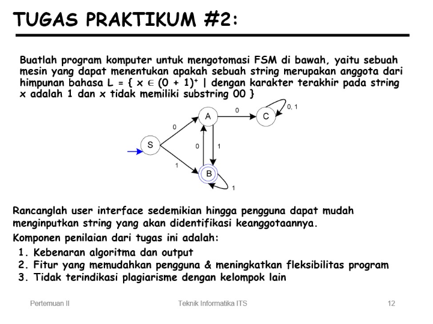

# Penjelasan Kode Jawaban Praktikum 2

## Soal
Buatlah program komputer untuk mengotomasi Finite State Machine (FSM) yang dapat menentukan apakah sebuah string termasuk dalam bahasa:
L = { x ∈ (0 + 1)⁺ | karakter terakhir adalah 1 dan tidak mengandung substring 00 }. Program juga harus memiliki user interface sederhana agar pengguna mudah menginput string.

## Jawaban & Penjelasan
Program ini bertujuan untuk mensimulasikan sebuah FSM yang membaca string biner (0 dan 1), kemudian menentukan apakah string tersebut diterima atau tidak berdasarkan aturan bahasa yang diberikan. Selain itu, program juga dilengkapi dengan visualisasi graf menggunakan library graphviz sehingga pengguna dapat melihat alur perpindahan state secara langsung.
```
from graphviz import Digraph
```
Library graphviz digunakan untuk visualisasi FSM dalam bentuk graf (diagram state). Ini adalah bagian penting dari UI karena pengguna tidak hanya melihat hasil, tapi juga alur perpindahan state (path).

## 1. Inisialisasi FSM

Pada bagian awal, program mendefinisikan kelas FSM Machine yang berisi struktur dasar FSM. Di dalamnya ditentukan state awal (S) dan state akhir (B) sebagai state penerima. FSM ini bekerja dengan konsep bahwa string hanya akan diterima jika: Tidak mengandung substring "00" dan Karakter terakhir adalah 1. Transisi antar state didefinisikan dalam bentuk dictionary. Setiap state memiliki aturan perpindahan berdasarkan input 0 atau 1. Misalnya, dari state S jika menerima input 0 akan berpindah ke A, sedangkan jika menerima 1 akan berpindah ke B.

Struktur state:

`S (Start State)  titik awal proses`
`A  kondisi setelah membaca angka 0`
`B (Accept State) kondisi valid (akhir harus di sini)`
`C (Trap State) kondisi gagal (biasanya karena "00")`

State C disebut trap state karena jika sudah masuk ke state ini, semua input berikutnya akan tetap berada di C dan otomatis ditolak.

## 2. Proses Pengecekan String

Fungsi `check_string` digunakan untuk membaca input dari pengguna. Proses ini dilakukan dengan cara menyisir string karakter demi karakter. Setiap karakter akan:
- Dicek validitasnya (harus 0 atau 1)
- Digunakan untuk menentukan perpindahan state berikutnya
- Disimpan dalam list path untuk melacak jalur FSM
Jika ditemukan karakter selain 0 atau 1, maka program akan langsung mengembalikan pesan error.

Setelah seluruh string diproses, program akan mengecek:

Jika state terakhir adalah B → string diterima (Accepted)
Jika bukan → string ditolak (Rejected)

## 3. Visualisasi FSM (User Interface)

Program ini memiliki keunggulan pada bagian visualisasi menggunakan graphviz. Fungsi `draw_fsm` digunakan untuk menggambar diagram FSM dalam bentuk graf. Beberapa fitur visual yang digunakan:
- Arah graf dibuat dari kiri ke kanan agar mudah dibaca
- State akhir (B) ditandai dengan double circle
- Ditambahkan node awal sebagai penunjuk start
- Semua transisi antar state ditampilkan lengkap

Yang paling penting adalah fitur highlight jalur input:
- Jalur yang dilalui oleh input user akan diberi warna merah
- Setiap langkah diberi nomor urutan
- Garis dibuat lebih tebal agar terlihat jelas

Dengan ini, pengguna tidak hanya melihat hasil, tetapi juga memahami bagaimana FSM bekerja secara visual.

## 4. Fungsi Utama (Interface Program)
Fungsi `run_fsm` bertindak sebagai penghubung antara pengguna dan sistem FSM. Fungsi ini:
- Menerima input string
- Memanggil fungsi pengecekan FSM
- Menampilkan hasil berupa:
- Input string
- Jalur perpindahan state
- Status diterima atau ditolak

Setelah itu, program akan menampilkan diagram FSM secara otomatis menggunakan Graphviz.

## 5. Test Case
Misalnya input yang diberikan adalah "110".

Proses yang terjadi:

S → B (input 1)
B → B (input 1)
B → A (input 0)

State akhir berada di A, bukan di B, sehingga string tersebut ditolak (Rejected). Selain itu, karena tidak berakhir dengan 1, maka tidak memenuhi syarat bahasa.

## Visualisasi Hasil FSM

