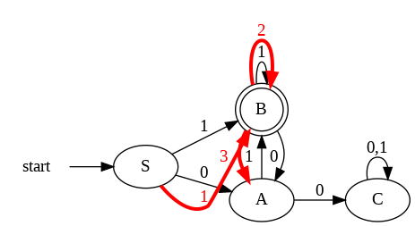

# Penjelasan Kode Jawaban Praktikum 2

## Soal


## Jawaban & Penjelasan
Program ini bertujuan untuk mensimulasikan sebuah FSM yang membaca string biner (0 dan 1), kemudian menentukan apakah string tersebut diterima atau tidak berdasarkan aturan bahasa yang diberikan. Selain itu, program juga dilengkapi dengan visualisasi graf menggunakan library graphviz sehingga pengguna dapat melihat alur perpindahan state secara langsung.
```
from graphviz import Digraph
```
Library graphviz digunakan untuk visualisasi FSM dalam bentuk graf (diagram state). Ini adalah bagian penting dari UI karena pengguna tidak hanya melihat hasil, tapi juga alur perpindahan state (path).

## 1. Inisialisasi FSM

Pada bagian awal, program mendefinisikan kelas FSM Machine yang berisi struktur dasar FSM. Di dalamnya ditentukan state awal (S) dan state akhir (B) sebagai state penerima. FSM ini bekerja dengan konsep bahwa string hanya akan diterima jika: Tidak mengandung substring "00" dan Karakter terakhir adalah 1. Transisi antar state didefinisikan dalam bentuk dictionary. Setiap state memiliki aturan perpindahan berdasarkan input 0 atau 1. Misalnya, dari state S jika menerima input 0 akan berpindah ke A, sedangkan jika menerima 1 akan berpindah ke B.

Struktur state:

`S (Start State)  titik awal proses`
`A  kondisi setelah membaca angka 0`
`B (Accept State) kondisi valid (akhir harus di sini)`
`C (Trap State) kondisi gagal (biasanya karena "00")`

State C disebut trap state karena jika sudah masuk ke state ini, semua input berikutnya akan tetap berada di C dan otomatis ditolak.

## 2. Proses Pengecekan String

Fungsi `check_string` digunakan untuk membaca input dari pengguna. Proses ini dilakukan dengan cara menyisir string karakter demi karakter. Setiap karakter akan:
- Dicek validitasnya (harus 0 atau 1)
- Digunakan untuk menentukan perpindahan state berikutnya
- Disimpan dalam list path untuk melacak jalur FSM
Jika ditemukan karakter selain 0 atau 1, maka program akan langsung mengembalikan pesan error.

Setelah seluruh string diproses, program akan mengecek:

Jika state terakhir adalah B → string diterima (Accepted)
Jika bukan → string ditolak (Rejected)

## 3. Visualisasi FSM (User Interface)

Program ini memiliki keunggulan pada bagian visualisasi menggunakan graphviz. Fungsi `draw_fsm` digunakan untuk menggambar diagram FSM dalam bentuk graf. Beberapa fitur visual yang digunakan:
- Arah graf dibuat dari kiri ke kanan agar mudah dibaca
- State akhir (B) ditandai dengan double circle
- Ditambahkan node awal sebagai penunjuk start
- Semua transisi antar state ditampilkan lengkap

Yang paling penting adalah fitur highlight jalur input:
- Jalur yang dilalui oleh input user akan diberi warna merah
- Setiap langkah diberi nomor urutan
- Garis dibuat lebih tebal agar terlihat jelas

Dengan ini, pengguna tidak hanya melihat hasil, tetapi juga memahami bagaimana FSM bekerja secara visual.

## 4. Fungsi Utama (Interface Program)
Fungsi `run_fsm` bertindak sebagai penghubung antara pengguna dan sistem FSM. Fungsi ini:
- Menerima input string
- Memanggil fungsi pengecekan FSM
- Menampilkan hasil berupa:
- Input string
- Jalur perpindahan state
- Status diterima atau ditolak

Setelah itu, program akan menampilkan diagram FSM secara otomatis menggunakan Graphviz.

## 5. Test Case
Misalnya input yang diberikan adalah "110".

Proses yang terjadi:

S → B (input 1)
B → B (input 1)
B → A (input 0)

State akhir berada di A, bukan di B, sehingga string tersebut ditolak (Rejected). Selain itu, karena tidak berakhir dengan 1, maka tidak memenuhi syarat bahasa.

## Visualisasi Hasil FSM


## Penjelasan Visualisasi FSM
Berdasarkan alur panah merah (path) yang merepresentasikan input string, misalnya "110". Proses ini berjalan dari kiri ke kanan, mengikuti setiap simbol dalam string dan berpindah state sesuai aturan transisi.
Pada awalnya, berada di state S (start). Ini adalah titik mulai sebelum membaca input apa pun. Ketika simbol pertama dibaca, FSM langsung berpindah sesuai aturan yang ada.

Langkah-langkah:
- Langkah 1 (input = 1)
Dari state S, ketika membaca angka 1, mesin berpindah ke state B. Ini terlihat dari panah merah dari S ke B dengan label 1. State B adalah state penerima, sehingga sejauh ini string masih valid.
- Langkah 2 (input = 1)
Dari state B, saat membaca angka 1 lagi, mesin tetap berada di state B (loop). Ini menunjukkan bahwa jika terus membaca angka 1, FSM tetap dalam kondisi aman. Pada gambar, ini ditunjukkan dengan panah melingkar di B yang diberi nomor langkah berikutnya.
- Langkah 3 (input = 0)
Dari state B, ketika membaca angka 0, mesin berpindah ke state A. Ini terlihat dari panah merah dari B ke A. State A bukan state penerima, sehingga posisi akhir ini menentukan hasil.

Setelah seluruh input selesai dibaca, FSM berhenti di state A. Karena state akhir bukan B (accept state), maka string dinyatakan Rejected.

- Jika dari state A membaca 0 lagi, maka akan masuk ke state C (trap state), yang berarti string mengandung substring "00" dan langsung tidak valid.
- State C memiliki loop untuk 0 dan 1, artinya jika sudah masuk ke sini, tidak bisa kembali ke kondisi valid.
- State B hanya bisa dicapai jika karakter terakhir adalah 1, sehingga memenuhi syarat akhir string.

## Analisis Komponen
1. Dari sisi kebenaran algoritma dan output, program yang dibuat sudah sesuai dengan konsep Deterministic Finite Automaton (DFA). Transisi antar state telah dirancang dengan benar untuk memenuhi aturan bahasa L, yaitu string harus berakhir dengan 1 dan tidak boleh mengandung substring “00”. Hal ini terlihat dari adanya state C sebagai trap state yang akan menangkap semua kondisi yang melanggar aturan tersebut. Selain itu, hasil output seperti “Accepted” atau “Rejected” ditentukan berdasarkan state akhir (B sebagai accept state), sehingga secara logika sudah tepat dan konsisten dengan teori automata.

2. Dari sisi fitur yang memudahkan pengguna dan fleksibilitas program, program ini sudah memiliki keunggulan dibanding implementasi dasar. Penggunaan library Graphviz memungkinkan visualisasi FSM dalam bentuk diagram, sehingga pengguna tidak hanya melihat hasil akhir, tetapi juga memahami alur perpindahan state melalui jalur berwarna merah. Output yang ditampilkan juga informatif karena mencakup input, path, dan hasil. Namun, fleksibilitasnya masih bisa ditingkatkan, misalnya dengan menambahkan loop input agar pengguna dapat mencoba beberapa string sekaligus, atau menyimpan hasil visualisasi ke file agar bisa digunakan dalam laporan.

3. Dari sisi orisinalitas (tidak terindikasi plagiarisme), program ini menunjukkan ciri pengembangan sendiri. Hal ini terlihat dari adanya kombinasi antara logika FSM, validasi input, serta visualisasi graf yang tidak hanya standar tetapi juga menambahkan fitur highlight path. Struktur kode yang modular (dipisah menjadi class FSM, fungsi visualisasi, dan fungsi utama) juga menunjukkan pemahaman konsep, bukan sekadar menyalin. Selain itu, penggunaan fitur tambahan seperti penomoran langkah pada jalur merah menjadi nilai tambah yang memperkuat keunikan implementasi.
